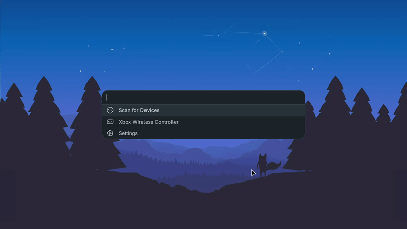

<div align="center">
  <h1>bzmenu</h1>
  <p>
    <a href="https://ko-fi.com/e_tho"></a>
    <a href="https://liberapay.com/e-tho"></a>
  </p>
  <p>
    
  </p>
  <p>
    <a href="https://github.com/e-tho/iwmenu" title="Try iwmenu: a launcher-driven Wi-Fi manager for Linux">
      
    </a>
  </p>
</div>

## About

`bzmenu` (**B**lue**Z** **Menu**) manages Bluetooth through your launcher of choice.

## Dependencies

### Build

- [`Rust`](https://www.rust-lang.org) (includes `cargo`)
- [`pkg-config`](https://www.freedesktop.org/wiki/Software/pkg-config) – For detecting required libraries
- [`dbus`](https://www.freedesktop.org/wiki/Software/dbus) – For D-Bus integration headers

### Runtime

- [`bluetoothd`](http://www.bluez.org) – BlueZ daemon
- [`dbus`](https://www.freedesktop.org/wiki/Software/dbus) – For communicating with `bluetoothd`
- A launcher with `stdin` mode support

#### Optional

- [NerdFonts](https://www.nerdfonts.com) – For font-based icons (default mode)
- [XDG icon theme](https://specifications.freedesktop.org/icon-theme-spec/latest) – For image-based icons (used with `-i xdg`, included with DEs or can be installed manually)
- [Notification daemon](https://specifications.freedesktop.org/notification-spec/latest) – For system notifications (e.g. `dunst`, `fnott`, included with DEs or can be installed manually)

## Compatibility

| Launcher                                      | Font Icons | XDG Icons | Notes                                                                                 |
| --------------------------------------------- | :--------: | :-------: | ------------------------------------------------------------------------------------- |
| [Fuzzel](https://codeberg.org/dnkl/fuzzel)    |     ✅     |    ✅     | XDG icons supported in main branch                                                    |
| [Rofi](https://github.com/davatorium/rofi)    |     ✅     |    🔄     | XDG icon support pending via [PR #2122](https://github.com/davatorium/rofi/pull/2122) |
| [Walker](https://github.com/abenz1267/walker) |     ✅     |    ✅     | XDG icons supported since v0.12.21                                                    |
| [dmenu](https://tools.suckless.org/dmenu)     |     ✅     |    ❌     | No XDG icon support                                                                   |
| Custom (stdin)                                |     ✅     |    ❔     | Depends on launcher implementation                                                    |

> [!TIP]
> If your preferred launcher isn't directly supported, use `custom` mode with appropriate command flags.

## Installation

### Build from source

Run the following commands:

```shell
git clone https://github.com/e-tho/bzmenu
cd bzmenu
cargo build --release
```

An executable file will be generated at `target/release/bzmenu`, which you can then copy to a directory in your `$PATH`.

### Nix

Install from nixpkgs:

```nix
{ pkgs, ... }:
{
  environment.systemPackages = [ pkgs.bzmenu ];
}
```

<details>
<summary>Alternative: Install from flake</summary>

Add flake as an input:

```nix
inputs.bzmenu.url = "github:e-tho/bzmenu";
```

Install from flake:

```nix
{ inputs, ... }:
{
  environment.systemPackages = [ inputs.bzmenu.packages.${pkgs.system}.default ];
}
```

</details>

### Alpine Linux

Install from the testing repository:

```shell
apk add bzmenu
```

### Arch Linux

Install from AUR with your favorite helper:

```shell
paru -S bzmenu # or bzmenu-git
```

## Usage

### Supported launchers

Specify an application using `-l` or `--launcher` flag.

```shell
bzmenu -l fuzzel
```

### Custom launchers

Specify `custom` as the launcher and set your command using the `--launcher-command` flag. Ensure your launcher supports `stdin` mode, and that it is properly configured in the command.

```shell
bzmenu -l custom --launcher-command "my_custom_launcher --flag"
```

#### Prompt and Placeholder support

Use either `{prompt}` or `{placeholder}` as the value for the relevant flag in your command; each will be replaced with the appropriate text as needed. They return the same string, with `{prompt}` adding a colon at the end.

```shell
bzmenu -l custom --launcher-command "my_custom_launcher --prompt-flag '{prompt}'" # or --placeholder-flag '{placeholder}'
```

#### Example to enable all features

This example demonstrates enabling all available features in custom mode with `fuzzel`.

```shell
bzmenu -l custom --launcher-command "fuzzel -d -p '{prompt}'"
```

### Available Options

| Flag                 | Description                                               | Supported Values                              | Default Value |
| -------------------- | --------------------------------------------------------- | --------------------------------------------- | ------------- |
| `-l`, `--launcher`   | Specify the launcher to use (**required**).               | `dmenu`, `rofi`, `fuzzel`, `walker`, `custom` | `None`        |
| `--launcher-command` | Specify the command to use when `custom` launcher is set. | Any valid shell command                       | `None`        |
| `-i`, `--icon`       | Specify the icon type to use.                             | `font`, `xdg`                                 | `font`        |
| `-s`, `--spaces`     | Specify icon to text space count (font icons only).       | Any positive integer                          | `1`           |
| `--scan-duration`    | Specify the duration of device discovery in seconds.      | Any positive integer                          | `10`          |

## Contributing

Please see [CONTRIBUTING.md](CONTRIBUTING.md) for contribution guidelines.

## License

This project is licensed under the terms of the GNU General Public License version 3, or (at your option) any later version.

## Support this project

If you find this project useful and would like to help me dedicate more time to its development, consider supporting my work.

[](https://ko-fi.com/e_tho)
[](https://liberapay.com/e-tho)
